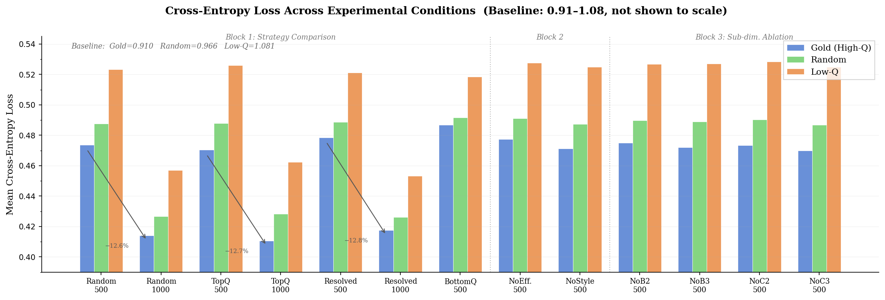
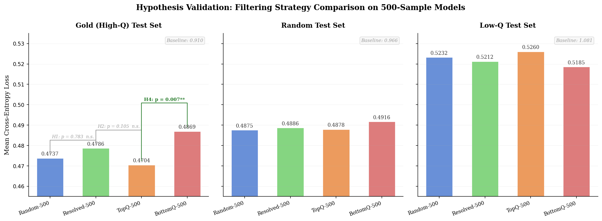
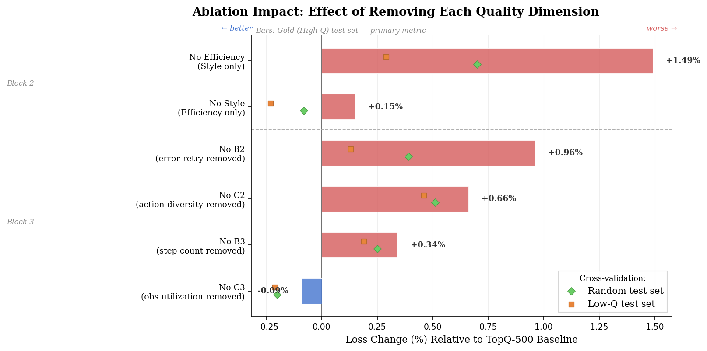
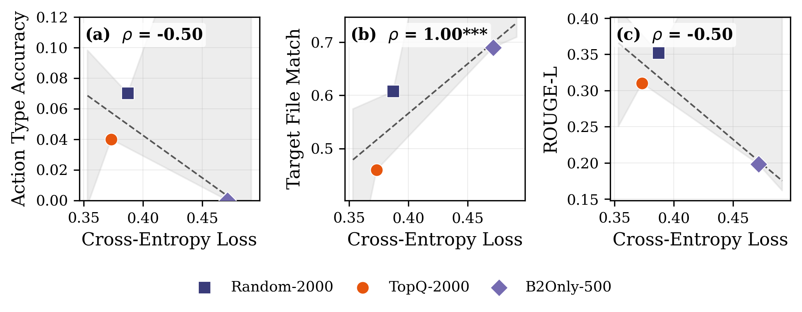
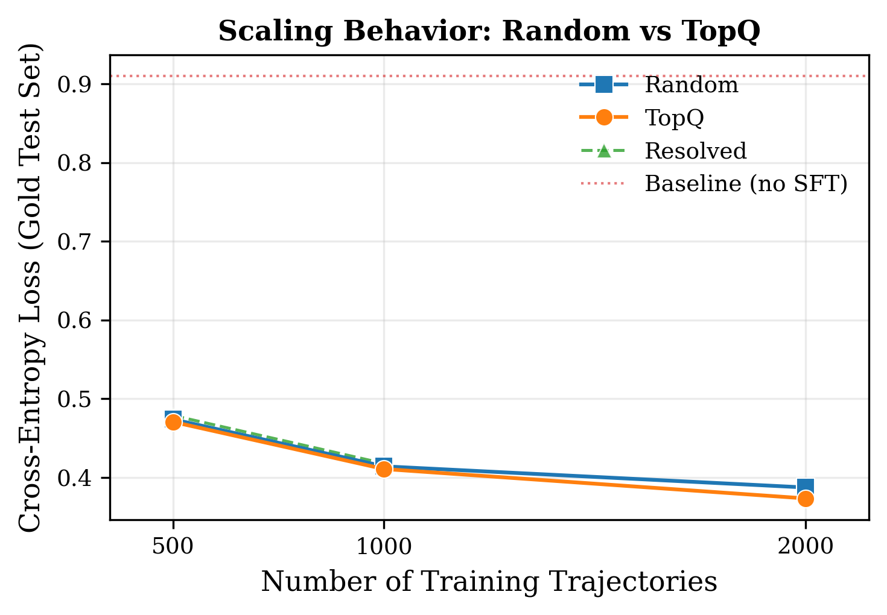
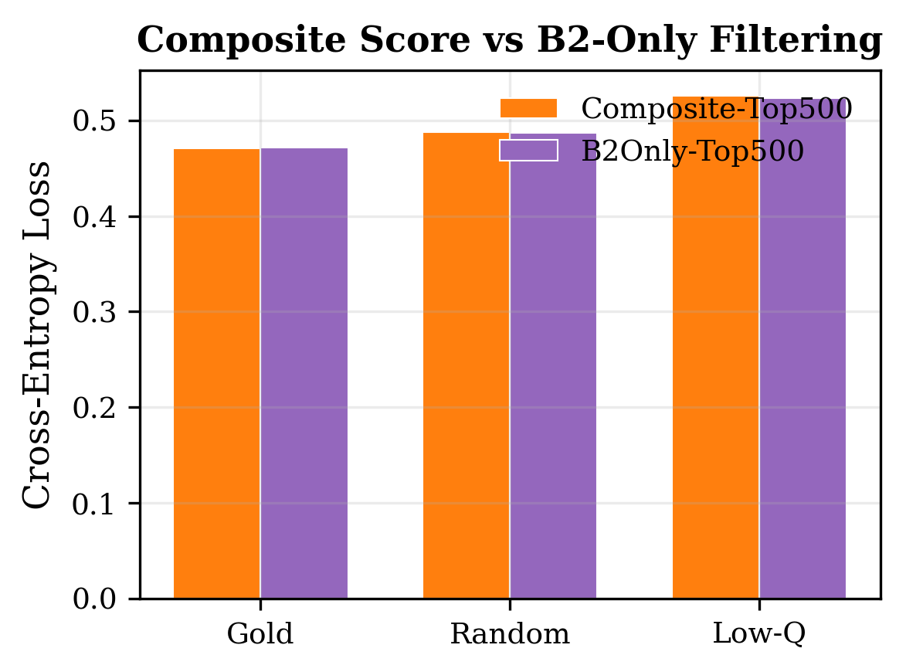

# Data Quantity Dominates Quality in LoRA Fine-Tuning for Code Agents

A systematic empirical study of data quality filtering strategies for LoRA fine-tuning of code agent LLMs on the SWE-trajectory dataset.

> **Paper**: *Data Quantity Dominates Quality in LoRA Fine-Tuning for Code Agents: A Systematic Study on Trajectory Data Filtering Strategies*
> **Venue**: ICIC 2026 (International Conference on Intelligent Computing)

## Key Finding

In the small-to-medium scale regime (500–2000 trajectories), **data quantity effects (~12.7% relative loss reduction)** substantially exceed **data quality filtering effects (~0.7%, p > 0.10)**. However, the widening quality gap at 2000 samples (3.6% vs 0.7% at 500) suggests a crossover point may exist at larger scales where quality filtering becomes the dominant factor.

> **Update (ICIC 2026 Revision):** In response to reviewer feedback, we added three supplementary validation experiments: (A) First-Action Evaluation for proxy metric validation, (B) scaling extension to 2000 trajectories, and (C) B2-only baseline comparison. See [Supplementary Validation](#supplementary-validation-icic-revision) below.

<p align="center">
  
</p>

## HuggingFace Resources

| Resource | Link | Description |
|----------|------|-------------|
| Quality-Scored Subsets | [huggingface.co/datasets/YOUR_USERNAME/swe-trajectory-quality-subsets](https://huggingface.co/datasets/YOUR_USERNAME/swe-trajectory-quality-subsets) | 13 curated training subsets with quality scores |
| LoRA Adapters | [huggingface.co/YOUR_USERNAME/swe-trajectory-lora-adapters](https://huggingface.co/YOUR_USERNAME/swe-trajectory-lora-adapters) | All 13 trained LoRA adapters (Qwen2.5-Coder-7B) |
| Evaluation Results | [huggingface.co/datasets/YOUR_USERNAME/swe-trajectory-eval-results](https://huggingface.co/datasets/YOUR_USERNAME/swe-trajectory-eval-results) | Perplexity & next-action prediction results |

> Replace `YOUR_USERNAME` with your actual HuggingFace username before publishing.

## Project Structure

```
swe-trajectory-quality-study/
├── README.md
├── requirements.txt
│
├── scripts/
│   ├── scoring/                    # Phase 1: Quality Scoring Framework
│   │   ├── run_analysis.py         # Entry point for scoring pipeline
│   │   ├── scoring.py              # Core scoring logic (B2, B3, C2, C3)
│   │   ├── scoring_config.py       # Metric definitions and thresholds
│   │   ├── analysis.py             # Statistical analysis utilities
│   │   └── scoring_visualize.py    # Score distribution visualization
│   │
│   ├── subset/                     # Phase 2: Subset Construction
│   │   ├── run_subset.py           # Entry point for subset builder
│   │   ├── builder.py              # Subset selection logic (TopQ, Random, etc.)
│   │   ├── subset_config.py        # Subset definitions (13 configs)
│   │   ├── subset_visualize.py     # Subset comparison visualizations
│   │   └── upload_to_hf.py         # Upload subsets to HuggingFace Hub
│   │
│   ├── training/                   # Phase 3: LoRA Fine-Tuning
│   │   ├── prepare_data.py         # ChatML serialization & tokenization
│   │   ├── train.py                # QLoRA training script (Qwen2.5-Coder-7B)
│   │   ├── configs.py              # Training hyperparameters
│   │   ├── run_experiments.sh      # Batch experiment runner
│   │   └── setup.sh                # Environment setup
│   │
│   └── evaluation/                 # Phase 4: Evaluation
│       ├── build_test_set.py       # Gold/Random/Low-Q test set construction
│       ├── eval_perplexity.py      # Cross-entropy loss evaluation (exp1-13)
│       ├── eval_perplexity_extended.py  # Extended perplexity eval (exp14-16, ICIC revision)
│       ├── eval_next_action.py     # Next-action prediction evaluation
│       ├── eval_first_action.py    # First-action generation evaluation (ICIC revision)
│       ├── analyze_results.py      # Statistical analysis & hypothesis testing
│       ├── run_eval.sh             # Single-model evaluation runner
│       └── run_pipeline.sh         # Full evaluation pipeline
│
├── data/
│   ├── quality_scores/
│   │   ├── summary_statistics.csv           # Aggregate scoring statistics
│   │   └── trajectory_analysis.csv          # Per-trajectory analysis data
│   │
│   ├── subsets/
│   │   ├── subset_comparison_table.csv      # Side-by-side subset statistics
│   │   ├── TopQ-500/metadata.json           # Subset metadata & stats
│   │   ├── TopQ-1000/metadata.json
│   │   ├── Random-500/metadata.json
│   │   ├── Random-1000/metadata.json
│   │   ├── ResolvedOnly-500/metadata.json
│   │   ├── ResolvedOnly-1000/metadata.json
│   │   ├── BottomQ-500/metadata.json
│   │   ├── Ablation-NoEfficiency-500/metadata.json
│   │   ├── Ablation-NoStyle-500/metadata.json
│   │   ├── Ablation-NoB2-500/metadata.json
│   │   ├── Ablation-NoB3-500/metadata.json
│   │   ├── Ablation-NoC2-500/metadata.json
│   │   └── Ablation-NoC3-500/metadata.json
│   │
│   ├── training_logs/
│   │   └── exp{1..13}_summary.json          # Per-experiment training stats
│   │
│   └── eval_results/
│       ├── perplexity_results.csv           # Loss/PPL results (exp1-13, 14 models x 3 test sets)
│       ├── perplexity_results_extended.csv  # Extended results (exp1-16, 17 models x 3 test sets)
│       ├── summary_table.csv                # Condensed result table
│       ├── next_action_results.json         # Action prediction accuracy & ROUGE-L
│       ├── first_action_results.json        # First-action inference outputs (ICIC revision)
│       ├── first_action_summary.csv         # First-action per-checkpoint metrics
│       ├── first_action_summary_extended.csv # First-action at 2000 scale
│       ├── first_action_correlation.json    # Spearman correlation metadata
│       ├── first_action_report.md           # First-action auto-generated report
│       ├── experiment_A_analysis.md         # Proxy metric validation analysis
│       ├── SUMMARY_REPORT.md                # Comprehensive validation results synthesis
│       ├── revision-plan.md                 # ICIC reviewer response plan
│       ├── test_set_ids.json                # Test set trajectory IDs (reproducibility)
│       ├── stats_report.md                  # Statistical test report
│       └── experiment_report.md             # Full experiment analysis
│
├── figures/
│   ├── fig1_score_distributions.png         # Score distributions (9 sub-metrics)
│   ├── fig2_loss_comparison.png             # Cross-entropy loss across conditions
│   ├── fig3_hypothesis_validation.png       # H1/H2/H4 hypothesis tests
│   ├── fig4_ablation_impact.png             # Ablation impact bar chart
│   ├── fig5_proxy_validation.png            # CE Loss vs ROUGE-L scatter (Exp A)
│   ├── fig6_scaling_curve.png               # Perplexity scaling 500→1000→2000 (Exp B)
│   ├── fig7_fa_scaling_curve.png            # First-Action ROUGE-L scaling (Exp B)
│   ├── fig8_b2only_ablation.png             # Composite vs B2-only comparison (Exp C)
│   ├── fig9_first_action_bars.png           # First-action grouped bar chart (Exp A)
│   ├── supp_quality_scores.png              # Supplementary: composite scores
│   ├── supp_token_distribution.png          # Supplementary: token length dist.
│   ├── supp_turn_distribution.png           # Supplementary: turn count dist.
│   ├── supp_subset_quality_box.png          # Supplementary: subset quality box
│   └── supp_subset_tokens.png              # Supplementary: subset token dist.
│
└── configs/
    └── experiment_design_v3.md              # Full experiment design document
```

## Experiment Overview

### Scoring Framework

We decompose trajectory quality along two axes with four sub-metrics:

| Dimension | Sub-metric | Description | Discriminability (sigma) |
|-----------|-----------|-------------|------------------------|
| **Efficiency** | B2: Error-Retry Rate | Detects action-error-retry loops | 0.286 (highest) |
| **Efficiency** | B3: Step-Count Ratio | Trajectory length vs. median | 0.063 |
| **Style** | C2: Action Diversity | Shannon entropy of action types | 0.046 |
| **Style** | C3: Obs. Utilization | Reference to observation entities | 0.118 |

### 16 Controlled Experiments

```
Block 1 — Strategy Comparison (7 experiments)
  Baseline (no SFT), Random-{500,1000}, TopQ-{500,1000},
  ResolvedOnly-{500,1000}, BottomQ-500

Block 2 — High-Level Ablation (2 experiments)
  NoEfficiency-500, NoStyle-500

Block 3 — Sub-Dimension Ablation (4 experiments)
  NoB2-500, NoB3-500, NoC2-500, NoC3-500

Block 4 — Supplementary Validation (3 experiments, added in revision)
  Random-2000, TopQ-2000, B2Only-500
```

### Main Results

| Hypothesis | Comparison | Result | p-value |
|-----------|-----------|--------|---------|
| H1: Gate effect | ResolvedOnly vs Random | Not supported | 0.783 |
| H2: Score effect | TopQ vs ResolvedOnly | Directionally correct | 0.105 |
| H3: Scaling | 500 → 1000 | **Strongly supported** (~12.7%) | < 0.001 |
| H4: Sanity check | TopQ vs BottomQ | **Significant** | 0.007 |
| H5: Efficiency > Style | NoEff vs NoStyle | Directionally correct | 0.154 |

**Supplementary Validation Results (ICIC Revision):**

| Finding | Evidence | Significance |
|---------|----------|-------------|
| CE Loss is a valid proxy | Spearman ρ = −1.00 (CE Loss vs ROUGE-L) | p < 0.001 |
| Scaling continues to 2000 | Random: −18.3%, TopQ: −20.7% (500→2000) | Diminishing but sustained |
| Quality-quantity crossover | TopQ−Random gap: 0.7%@500 → 3.6%@2000 | 4× widening at scale |
| B2 ≈ Composite @500 | CE Loss: 0.4714 vs 0.4704 (Δ = 0.2%) | Not significant |

<p align="center">
  
  <br><em>Fig. 3: Hypothesis validation across three test sets</em>
</p>

<p align="center">
  
  <br><em>Fig. 4: Ablation impact — B2 (error-retry) is the most impactful sub-dimension</em>
</p>

## Supplementary Validation (ICIC Revision)

In response to ICIC 2026 reviewer feedback, we conducted three additional validation experiments addressing the following concerns: (1) proxy metric lacks downstream validation, (2) scale too small (500–1000 only), (3) composite score vs single-metric baseline, and (4) need for improved statistical reporting.

### Experiment A: First-Action Evaluation (Proxy Metric Validation)

Since the 7B model achieves near-zero resolve rate on SWE-bench, end-to-end evaluation is infeasible. Instead, we evaluate **first-action generation quality**: given an issue prompt, the model generates its first action, which is compared against the ground truth trajectory's first step using ROUGE-L, file match score, and action type accuracy.

| Checkpoint | Strategy | CE Loss (Gold) | ROUGE-L | File Match |
|---|---|---|---|---|
| baseline | No fine-tune | 0.9100 | 0.137 | 0.573 |
| exp1 | Random-500 | 0.4737 | 0.200 | 0.680 |
| exp3 | TopQ-500 | 0.4704 | 0.212 | 0.670 |
| exp2 | Random-1000 | 0.4140 | 0.248 | 0.650 |

**Spearman correlation between CE Loss and ROUGE-L: ρ = −1.00 (p < 0.001)** — a perfect monotonic relationship, validating CE loss as a reliable proxy for downstream action quality.

<p align="center">
  
  <br><em>Fig. 5: CE Loss vs First-Action ROUGE-L — perfect negative correlation validates proxy metric</em>
</p>

### Experiment B: Scale Extension to 2000

We extended experiments to 2000 trajectories to test the quality-quantity crossover hypothesis.

| Strategy | 500 | 1000 | 2000 | Δ (500→2000) |
|---|---|---|---|---|
| Random | 0.4737 | 0.4140 | 0.3871 | −18.3% |
| TopQ | 0.4704 | 0.4106 | 0.3732 | −20.7% |
| **TopQ − Random** | **0.003 (0.7%)** | **0.003 (0.8%)** | **0.014 (3.6%)** | **4× widening** |

A quality-quantity crossover signal emerges at 2000 samples: the CE loss gap between TopQ and Random widens from 0.003 at 500 samples to 0.014 at 2000 samples, suggesting quality filtering becomes increasingly important at larger scales.

<p align="center">
  
  <br><em>Fig. 6: CE Loss scaling curve — quality gap widens at 2000 samples</em>
</p>

### Experiment C: B2-Only Baseline

We compared the full composite score against using B2 (error-retry rate) alone for selection at 500 samples.

| Strategy | CE Loss (Gold) | PPL |
|---|---|---|
| Composite-Top500 | 0.4704 | 1.601 |
| B2Only-Top500 | 0.4714 | 1.602 |

The difference is negligible (Δ = 0.001, 0.2%), confirming that practitioners can use B2 alone as a lightweight proxy. However, the composite score provides a more principled framework that may yield greater benefits at larger scales.

<p align="center">
  
  <br><em>Fig. 8: Composite vs B2-only selection — comparable at 500 samples</em>
</p>

## Reproducing the Experiments

### Prerequisites

```bash
pip install -r requirements.txt
```

Hardware: NVIDIA A100 80GB GPU (PyTorch 2.4.0, CUDA 12.4.1)

### Step 1: Quality Scoring

```bash
# Score all 67,074 trajectories
python scripts/scoring/run_analysis.py \
    --input /path/to/swe-trajectory-dataset \
    --output data/quality_scores/
```

### Step 2: Subset Construction

```bash
# Build all 13 training subsets
python scripts/subset/run_subset.py \
    --scores data/quality_scores/trajectory_scored_v3.csv \
    --output data/subsets/
```

### Step 3: Training (13 experiments)

```bash
# Run all experiments
bash scripts/training/run_experiments.sh
```

### Step 4: Evaluation

```bash
# Build test sets and run full evaluation
bash scripts/evaluation/run_pipeline.sh
```

<<<<<<< HEAD
=======
### Step 5: Supplementary Validation (ICIC Revision)

```bash
# Run first-action evaluation (Experiment A)
python scripts/evaluation/eval_first_action.py \
    --models baseline exp1 exp2 exp3

# Run extended perplexity evaluation (Experiment B+C: exp14-16)
python scripts/evaluation/eval_perplexity_extended.py \
    --models exp14 exp15 exp16

# Run first-action evaluation for scaling experiments
python scripts/evaluation/eval_first_action.py \
    --models exp14 exp15 exp16

# Generate validation figures only (from existing results)
python scripts/evaluation/eval_first_action.py --plot-only
```

## Citation

```bibtex
@inproceedings{anonymous2026quantity,
  title={Data Quantity Dominates Quality in {LoRA} Fine-Tuning for Code Agents: A Systematic Study on Trajectory Data Filtering Strategies},
  author={Anonymous},
  booktitle={Proceedings of the International Conference on Intelligent Computing (ICIC)},
  year={2026}
}
```
>>>>>>> 57c9902 (Add new evaluation results)

## License

This project is released under the MIT License. See [LICENSE](LICENSE) for details.
